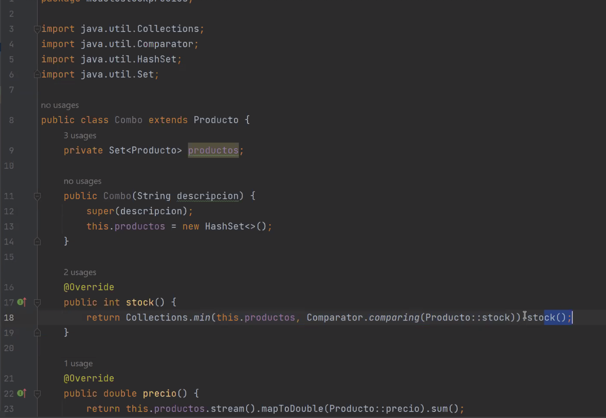
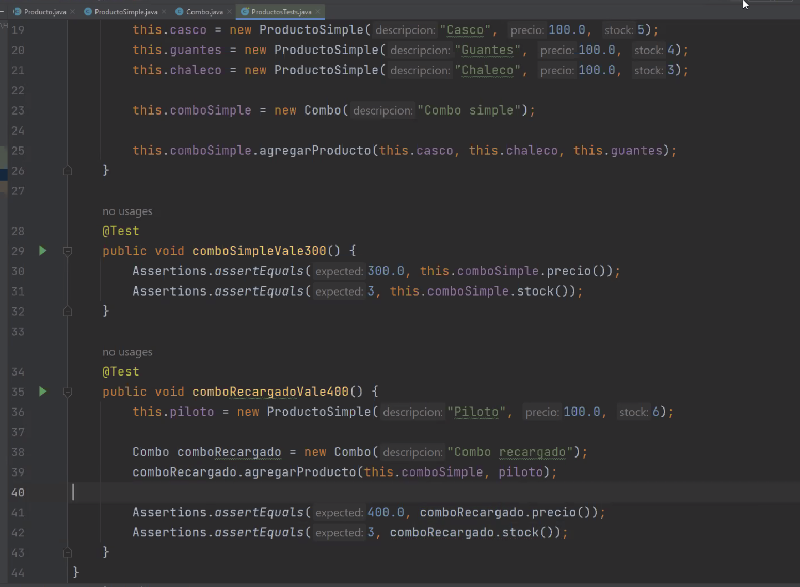

1. 'unicamente' Las interfaces pueden tener metodos abstractos -> F. clases abstractas tambien.

2. Suponga una plataforma e-commerce internacional. que atributo de calidad considera mas importante?
 - Disponiblidad
 - Performance
 - UX
 - CX (customer experience) -> V. Customer expierence vendria a abarcar las 3 demas. Mas vista del negocio en cuanto a la experiencia del cliente.

3. La calidad NO se puede probar?
- V. Los tests NO me aseguran que sea de buena calidad. Puedo MEDIR pero no probar la buena calidad.Los tests te aseguran la funcionalidad.

4. Para evaluar la calidad de un sistema es mejor medir y  analizar su disponibilidad que su performance:
- Falso. Un sistema no es mejor ni otro por un atributo de calidad, sino que depende el contexto

5. Se puede usar strategy en prolog? NO. solo existe en POO.

6. Cual no es una caracteristica de un buen disenio? la BAJA cohesion. - se necesita alta cohesion, bajo acoplamiento 

7. Los patrones de disenio son -> soluciones conocidas a problemas conocidos del mundo del desarrollo de sw

8. si se sabe que el comportamiento de una clase depende de su estado, entonces se podria aplicar:
- estado como enum (definitivamente no)
- lista de estados con variables booleanas
- Patron strategy
- Patron STATE -> V.

9. El atributo testeabilidad, lo podemos encontrar dentro de:
- Fiabilidad
- Seguridad 
- Funcionalidad
- Mantenibilidad -> iso 25mil

10. el principal objetivo de diseniar un sistema es:
    1. tomar decisiones
    2. construir y comunicar modelos
    3. construir y comunicar software
    4. encontrar la solucion a un problema o necesidad. V -> Esto es el principal objetivo, todo lo demas viene solo en base a este.


Ejercicio de modelado de stock:

- mientras modelando: En Producto se define que el metodo para devolver mi stock sera int y ya acoto la funcion. Tambien se agregan como atributos getters y setters precio y stock

- Modelo combo, tambien va a tener un precio y un stock como metodos. Me voy replanteando si sera necesario alguna interfaz o clase en comun que los relacione para reutilizar los metodos. Tomo la decision de hacer un atributo tipo SET de productos para q no tenga repetidos el combo.
Como el precio del combo es el resultado de cada producto que contiene, el metodo precio() de el sera un metodo calculado, no un getter.
Me doy cuenta tambien que los combos son a demanda del stock de cada producto. Entonces en el stock() del combo me tendria que quedar con el minimo de stock del producto (porq me condiciona)

- Empiezo a pensar en el combo de combos y ya existe un problema de estructura porque todavia mi disenio no lo permite.
Lo soluciono creando una clase abstracta(aunq no se toleren tanto en la cursada) llamada Producto, y lo que antes era Producto ahora es ProductoSimple. Ahora de la clase abstracta producto heredan productoSimple y Combo.
Entonces para habilitar que se generen combos de combos, el metodo Combo tendra el set de la clase abstracta Producto, entonces dentro de ese SET podra haber tanto Producto simple o otro combo.

- pq la clase abstracta? la unica razon valida seria porq seguro nos pidan agregar algun producto o componente mas que se compartan entre ellos. Aun asi no cierra tanto, una interfaz cumple totalmente y solo repetiria un par de atributos.

- En precio() del combo puedo usar mapToDouble. y dentro un Producto::precio en vez de usar el lambda. NO lo puedo usar siempre

- En stock() del combo: MapToInt.Min() sirve pero: 

            return Colecctions.min(this.productos, Comparator.comparing())


```TODO: COMPOSITE , DECORATOR```

##<u>codigo</u>:
combo:




test productos:



### TP:

- tarea: ver seminario api rest pt 1 y 2. 
 - ver video de integracion a la api rest de geo

CU: 


