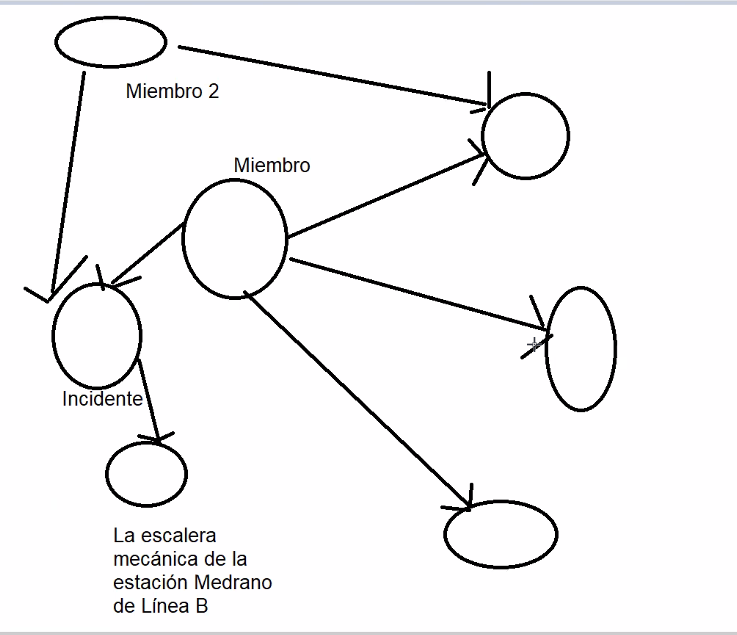

# TP 
## NOTAS ENTREGA 3:

1. Ahora una persona avisa un incidente a su comunidad, pero la comunidad opera de forma aislada entonces no avisa globalmente. Ahora que pasa si el miembro pertenece a varias comunidades? para pensar.

2. No hacerse problema por la parte de que el servicio es compuesto y bla bla bla. Porque todavia se mantiene que el servicio sea general y la descripcion tenga lo que tenga que tener y punto. Eze recomienda no modelar pero dice de negociarlo con el ayudante -> si lo llegamo a hacer composite puede llegar a ayudar.

3. como hacer envio de mail o de wpp:
    - email se resuelve encontrando algo en el repositorio global de maven
    - wpp con twilio https://www.twilio.com/es-mx/docs/whatsapp (la cuenta corre por twilio). Adapter para usarlo.
    - wassenger para notificar los incidentes via wpp

4. cierre de incidentes: para pensar y preguntar. uno ABRE Y CIERRA incidentes solo a las comunidades que pertenece.

5. comunidad cerrada: grafico

6. sin apuros: notificaciones cron -> patron command puede ayudar a inspirarse en el y tomar una idea.

7. como no tenemos db podemos pensar z un RepositorioDeNotificaciones, Aunq no es necesario del todo meterlo. Si lo metemos, no pasar de capa de dominio a repository directamente, sino pasar por el controller.