# PRINCIPIOS SOLID:

1. <b> SINGLE RESPONSABILITY PRINCIPLE </b>
    - clases cohesivas, una unica responsabilidad
    - evitar clase dios
    - resp ecapsulada x la clase

2. <b>OPEN CLOSED PRINCIPLE: </b>
    - entidades deben estar abiertas para expansion(extensibilidad, etc), cerradas para modificacion(si me viene un requerimiento nuevo NO)
    - es la implementacion de herencias e interfaces para resolver el problema
    - sugiere evitar switchs y propiciar polimorfismo entre objetos

3. <b>LISKOV SUBSTITUTION PRINCIPLE: </b>
    - dificil de cumplirlo
    - Siempre intenta tipar con la clase o interfaz mas general que puedas
    - Cada clase que hereda de otra puede usarse como su superclase sin necesidad de conocer las diferencias entre las clases derivadas. Lo mismo para interfaces.
    - Se propicia el polimorfismo pero a veces no es indispensable, cuidado.
    - Osea las clases hijas, no deberian tener mas metodos que los que tiene la superclase
    - no hace falta forzarlo ni cumplirlo.

4. <b> INTERFACE SEGREGATION PRINCIPLE: </b>
    - disenio orientado a interfaces
    - un objeto necesita conocer del otro lo minimo
    - Los clientes de un componente(objeto, etc) solo deberian conocer de este aquellos metodos que realmente usan y no aquellos que no necesitan usar
    - Muchas interfaces cliente especificas son mejores que una interfaz de proposito general
    - Se deberia propiciar un disenio orientado a interfaces, para mantener el acoplamiento entre clases al minimo posible, y tambien evitar generar interfaces extensas (con muchos metodos)

5. <b> DEPENDENCY INVERSION PRINCIPLE:</b>
    - Los modulos de lato nivel no deben depender de modulos de bajo nivel. Ambos deben depender de abstracciones.
    - Es una forma de desacoplar modulos.
    - Se sugiere utilizar inyectores de dependencias.
    - las abstracciones mas generales no deberian depender de las mas especificas, sino alrevez (?)

# REFACTORING:

- NO es incorporar funcionalidades nuevas
- NO es optimizar codigo
- ES cambiar la estructura del codigo para hacerlo mas simple y extensible.
    - cambiar nombre de clase,metodo,etc
    - reemplazar condicionales por objetos polimorficos
    - separar clase en varias

El refactor busca:
1. metodos cortos y nombres definidos
2. metodos y clases con responsabilidades claras
3. respecto a las variables de instancia: hay que evaluar costo-beneficio de tener en variables valores que pueden calcularse, como el total de deuda de un cliente, o cant de hijos de un empleado. 
    - motivo: desnormalizacion de datos: dato que puedo calcular, pero decido guardarlo por algun proposito. Ej: si es muy consultado el dato, en vez de tener el calculado en forma de un count de una collecion(calcula siempre), es mejor tenerlo como un contador o acumulador.
4. No tener GOD objects ni managers. Objetos que roban responsabilidades que les corresponden a otros objetos.
5. Preferible Objetos chicos, a grandes con muchas responsabilidades.
6. Evitar ciclos de dependencia entre objetos si no los necesito. Intentar evitar relaciones bidireccionales innecesarias. EJ: Cada cliente conoce a sus facturas, la factura necesita conocer al cliente?.

# CODE SMELLS:

- Hacer las cosas una sola vez
- Dont repeat yourself (DRY)
- Dos de las formas mas conocidas para evitar este smell en disenio es la composicion y herencia.

- Se podria seguir refactorizando, aplicando template method ya que hacen lo mismo los dos hasta en el mismo orden.

## <u> METODOS LARGOS: </u>

El metodo largo podemos descomponerlo en varias partes.

## <u> GOD CLASS: </u>

- Clases con demasiadas responsabilidades, que estan fuertemente acopladas a muchos otros objetos y que por consecuencia ante cualquier cambio se ven afectadas
- NUNCA hacer una clase que se llame SISTEMA xd
- SOLUCIONES A GOD CLASS:
    
    1. Generar nuevas clases: Principio de responsabilidad unica (S de SOLID):
    2. Generar subclases: Principio de Liskov. Que no se intente cambiar el tipo generico (GODCLASS) que antes estaba usando. A cada clase hija la debo tratar como la mas general.
    3. Generar interfaces: Segregacion de interfaces

Si la god class es respponsable de una interfaz grafica, se debe comenzxar a pensar en el patron MVC, e ir descomponiendo a las responsabilidades entre las diferentes capas involucradas

## <u> PARAMETROS LARGOS: </u>

- Puede darse cuando varios algoritmos se combinan en un metodo <?>

- Si un objeto va a brindar un servicio a otro, lo mejor seria que la cantidad de parametros del metodo en cuestion no varie

EJ:
    

Ahora se creo un objeto de tipo BusquedaPelicula. Todos esos parametros pasaron a estar dentro de busqueda pelicula.

        BusquedaPelicula()
            - nombre
            - autor
            - estrellas
            - ...
            - DIRECTOR (nueva) -> la agrego sin romper los parametros

## <u> CADENA DE MSJS: </u>

Si un objeto envia un msj de la forma

        a.b().c().d();

Va en contra del consejo `tell, dont ask` o, `dont talk to strangers`, donde un objeto deberia (deeeberia, no hace falta cumplirlo SI O SI) enviar mensajes:
- a si mismo
- a objetos que conoce (como variables de instancia)
- a objetos que recibe como parametro
- a objetos que instancia

`A VECES` se hace adrede para no generar un stackoverflow con la pila de mensajes

no es un code smell tan impotante.

## <u> HERENCIA RECHAZADA: </u>

Se puede dar cuando una clase sobreescribe completamente un metodo base definido por su padre sin importarle lo que este le haya dicho que tenia que hacer, o cuando una clase hereda metodos que en realidad no deberia tener.

La herencia es rigida:
    - Obliga a definir mas metodos que los necesarios(en ciertos casos)
    - En la mayoria de los lenguajes la herencia es simple lo que la transforma en limitante

posible solucion: si no son lo mismo par que forzarlo? usar COMPOSICION (interfaz y distintas clases para tratarlas polimorficamente)  POR SOBRE HERENCIA

## <u> LAZY CLASS: </u>

- Caso de extrema delegacion o porque el componente fue creado 'por las dudas'
- Para evitarlo:
    - No agregar funcionalidad hasta que sea necesario. YAGNI('no lo necesitas')
    - Eliminar de nuestro disenio las clases que no hagan nada, si necesito algo asi a lo sumo tengo el mockeo.

## <u> NOMBRES DE VARIABLES CORTOS O ILEGIBLES: </u>

Los nombres:
- Deben tener expresividad
- Deben representar su funcionalidad

## <u> Nombre de metodo muy largo: </u>

Si nos esta costando elegir un nombre bien representativo para el metodo y nos queda muy largo, seguramente hay mas de una logica comprendida dentro del mismo.

## <u> CODIGO MUERTO: </u>

- Codigo 'por las dudas' ->  se borra
- Comentarios tambien considerados

## <u> PRIMITIVE OBSSESION: </u>

Suele darse al representar con ints, booleans o Strings o enums cosas que podrian ser objetos con comportamiento. Las enums nos llevan a tener sentencias condicionales en lugar de trabajar con objetos polimorficos.

SOLUCION: Buscar abstracciones que nos permitan trabajar polimorficamente

## <u> DATA CLASS - ONLY ACCESORS: </u>

Una clase que solo representa datos es reconocible porque solo presenta setters y getters.

Separar una clase en DOS innecesariamente.

        Alumno
            - datos: DataAlumno
        metodo1(){

        }

        Data Alumno
            - edad
            - materias

## <u> METODOS FUERA DE LUGAR E INTERMEDIARIO: </u>

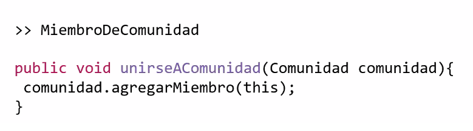

Si no accedemos a nigun atributo ni tampoco utilizamos comportamiento interno, posiblemente estamos ubicando mal el metodo. Por q no enviar directamente el msj

 
 
 
 

# ENTITIY VS VALUE OBJECT:

Tanto las entidades como los value objects representan abstracciones para el dominio.

DIFERENCIA: Las ENTIDADES son generalmente, abstracciones principales (CORE) y/o relevantes para el dominio con sentido de existencia propio (o anidadas a otras entidades), mientras que los VALUE OBJECTS generalmente representan abstracciones accesorias.

ejemplos:
- En tendencias musicales: la clase Artista era una ENTIDAD core
- tenemos una clase Alumno con atributo 'telefono', el cual podria estar siendo representando con una instancia de la clase 'telefono'. Esta clase podria tener como atributos el numero, codigo de area, etcetcetc.

<b>TIPOS DE IGUALDAD: </b>

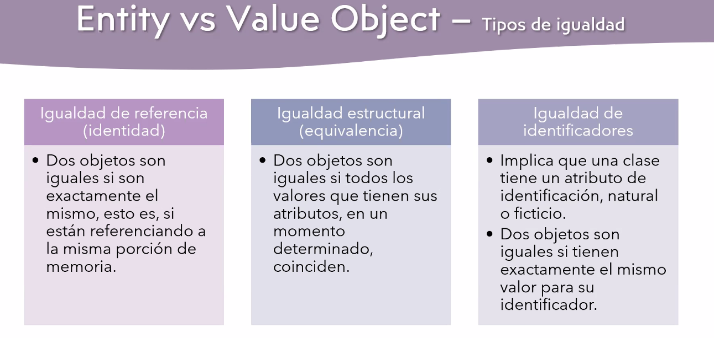

<b>VIDA:</b>
- Los VALUE OBJECTS No tienen algo que los identifique de forma univoca, las ENTIDADES SI.
- Las ENTIDADES viven 'A largo plazo', pueden tener historial, tienen sentido de existencia propio.
- Los VALUE OBJECTS son desechables, vida util 'muy corta'. No tienen sentido de existencia propia.

<b>INMUTABILIDAD:</b>
 
- ENTIDADES: Generalmente, son `mutables`, es decir que sus atributos pueden cambiar sus valores a lo largo del tiempo.

- V.O: Son `inmutables`. Los atributos NO pueden cambiar de valores. Si se necesita cambiar el valor de algun atributo, se DESECHA la instancia y se crea un VO nuevo.

En JAVA, para darle INMUTABILIDAD a un objeto se usa la palabra 'final'
 
 
 
### <u><b> ENTIDAD O VALUE OBJECT? </b> </u>

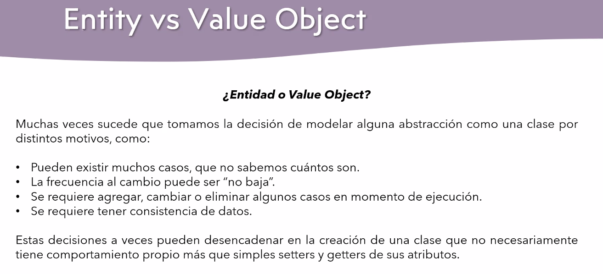

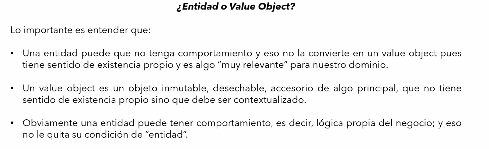

 
 
 

# MODELADO DE USUARIOS, ROLES Y PERMISOS PT.1

## RESPONSABILIDADES DE CAPAS DE UN SISTEMA:

Muchas veces el POO nos lleva a confundir asignacion de responsabilidades entre las distintas capas que puede tener un Sistema.

EJEMPLO Q ESTA MAL: 
METODO unirse_a_comunidad() ponerlo en una clase
o
METODO administrar_etc() en la clase admin.

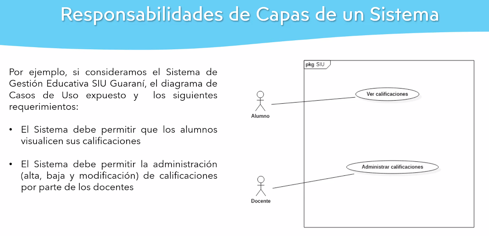

- SERIA INCORRECTO PLANTEAR:
    - una clase ALUMNO con un metodo 'verCalificaciones': Que haria ese metodo?
    - una clase DOCENTE con un metodo 'administrarCalifiaciones', nuevamente, que haria ese metodo? 
    NADA. PENSAMIENTO INCORRECTO

    La discusion no pasa por entender de que solamente los docentes pueden administrar las notas, sino por la abstraccion de capas. Pasa por estar mezclando responsabilidades de distintas capas del sistema. ULTIMO CODE SMELL. Also, estaria creando una god class.

 
 

- QUE ES LO CORRECTO?

- CAPA DE PRESENTACION: 
    - Capa encargada de presentar datos al user, con la cual interactuara.
    - No necesariamente es visual.
    - La forma de presentacion de datos la podemos dividir de 2 formas:
        - Presentacion de datos mediante interfaz grafica(desktop,web,movil)
        - Presentacion mediante APIs(API REST)

- CAPA DE DOMINIO/NEGOCIO:
    - Es la capa encargada de modelar las reglas de negocio, las `ENTIDADES` del dominio. ES LA QUE ESTAMOS REALIZANDO EN EL TP AHORA. 
    - Contiene la parte estructural. 

- CAPA DE DATOS:
    - Capa encargada de la manipulacion de la persistencia de datos del sistema.
    - preguntas como donde obtengo a los alumnos del sistema? donde recupero los docentes del sistema? corresponden a esta capa.
    - Si existe persistencia en una BD, esta capa se encargara de comunicar con ella.

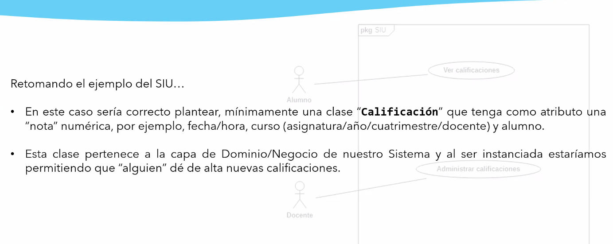

- como permitimos que un docente genere(instancie) una calificacion entonces? y si un admin de la plataforma o bedel tambien puede administrar las calificaciones?

- Me interesa la entidad Administrador, bedel y docente? El DOCENTE si porque me interesas mas datos de el, las otras NO, solo tendran acceso al sistema y listo. Entonces si seria al pedo crear una clase BEDEL o ADMIN, solamente son ROLES.

ENTONCES:

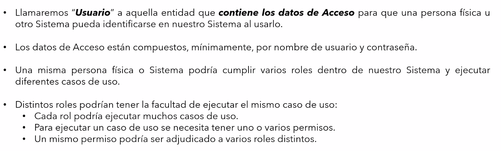
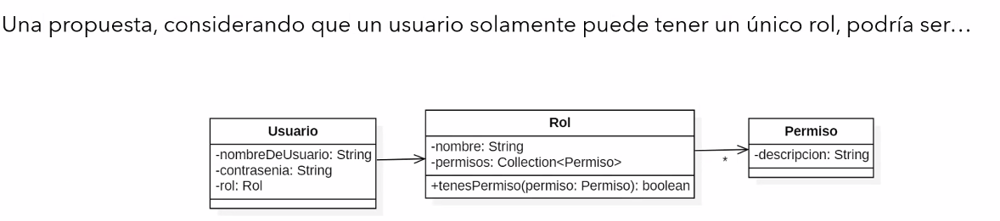
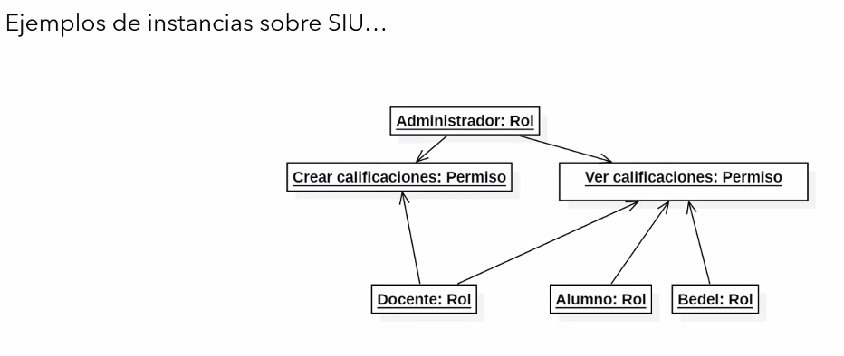

No es la unica propuesta de disenio para los usuarios, roles y permisos

- los permisos podrian estar modelados con enums, entendiendo que trae ciertas limitaciones...
- ?<?>

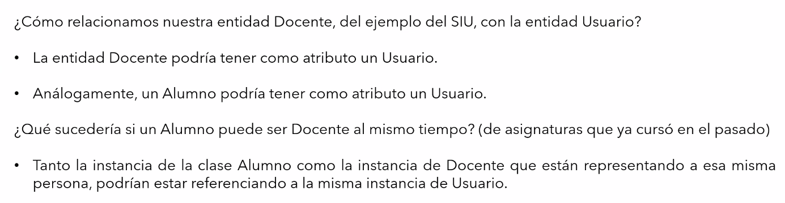

Para el BEDEL o el ADMINISTRADOR, NO VOY a crear una clase por ellos dos, porque simplemente son un ROL, que no van a tener comportamiento.

en el tp: entidad miembro SI me interesa, entidad ADMIN de la plataforma NO interesa, solamente tiene un rol, asique no es una entidad.

Donde podriamos instanciar nuestros objetos, donde los podriamos configurar o verificar las acciones? `CAPA DE CONTROLADORES`

### <b> CAPA DE CONTROLADORES: </b>
SON LOS UNICOS QUE DEBERIAN COMUNICARSE CON LAS DEMAS CAPAS. OSEA, YO NUNCA, desde la clase alumno, clase docente, acceder a la clase crearCalificacion, o alguna otra parecida.

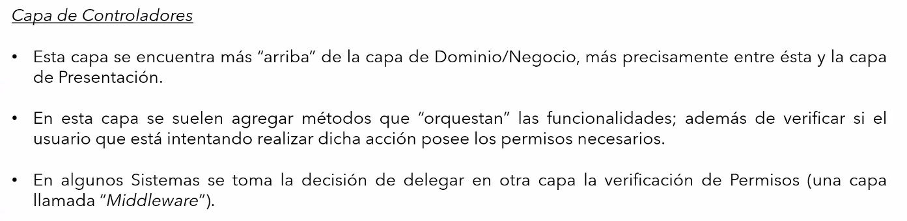
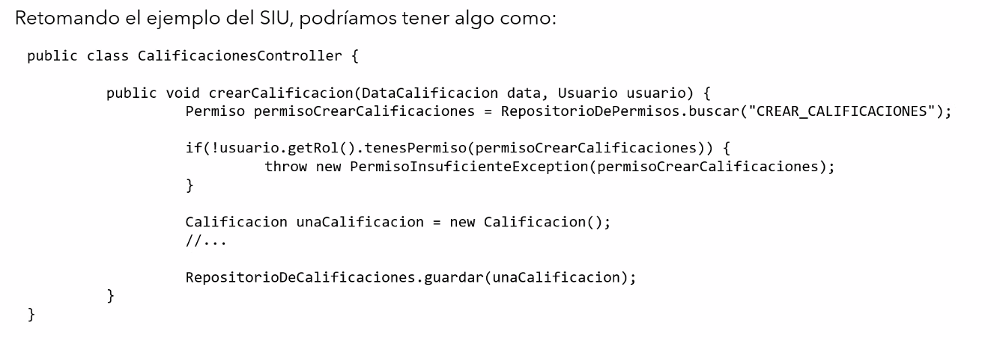
- DataCalificacion es un Value Object, usuario es el usuario que esta intentando crear la calificacion.

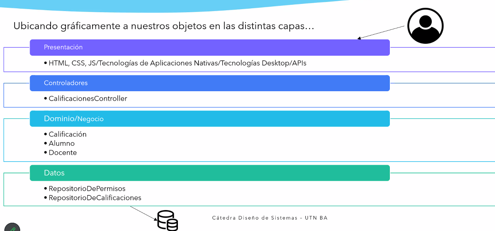

Lo ideal es tener UN CONTROLADOR por cada clase o entidad. sino seria un controlador God class.

 
 

# <b> BIBLIOTECA VS FRAMEWORK: </b>

BIBLIOTECAS:
- bibliotecas que contienen funcionalidades que el dev puede optar por usarlas o no. Uso una biblioteca que resuelve un problema. Se compila y carga todo el codigo de un tercero o no.

- el flujo lo tengo yo, esto no pasa en los frameworks

FRAMEWORKS:
- me otorga funcionalidades, pero ya es una estructura, ya me da un marco de trabajo. Suelen ser ellos el flujo de ejecucion del programa e invertir el control.
- el framework llama a nuestro codigo en cambio a la biblioteca nosotros la llamamos.
- se dividen en:
    - DOGMATICOS -estructura rigida y definida, con una "manera correcta".- (SpringBoot, Django, Laravel)
    - NO DOGMATICOS -menos restrictivo, estructura mas flexible- (ExpressJS)

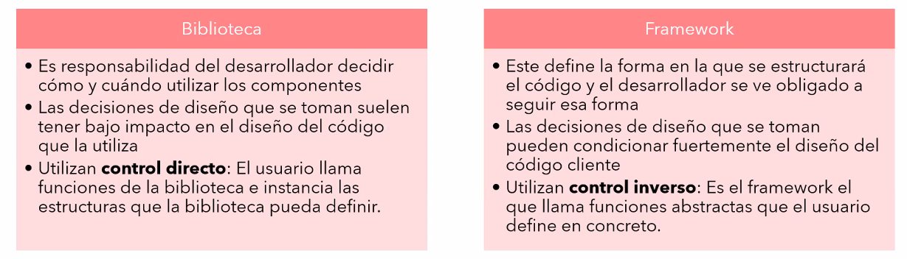

# <b> INYECCION DE DEPENDENCIA: </b>

ANALIZANDO LAS 3 POSIBLIDADES
1. SINGLETON:

DETALLE: lo unico que le falta es que el constructor sea privado para que sea solo la misma clase la que lo puede instanciar

2. SERVICE LOCATOR

3. INYECCION DE DEPENDENCIA
No le pide a NADIE(a ninguna clase) el objeto. Me llega por alguien que no me importa quien.

RESUMEN DE DIFERENCIAS:

 
 
 
 
 

# TP:

- Si hicimos clase USUARIO, o MIEMBRO, es tendencia a ser clase DIOS. Estara fuertemente acoplada al resto de las clases.

- EN CASOS DE USO NUNCA PONER LA PALABRA USUARIO, identificar ROLES mejor. Verbos en infinitivo.

- en el tp: entidad miembro SI me interesa, entidad ADMIN de la plataforma NO interesa, solamente tiene un rol, asique no es una entidad.

- Por ahora, los usuarios entonces ni se graficarian en el modelo, porque son ROLES hasta ahora, NO tienen ninguna relevancia en el dominio. SI tendra importancia en los CASOS DE USO y ahi se se va a graficar como interactua.

<!-- to research:
- polimorfismo -->

## OFF THE RECORD
- Se puede INSTANCIAR OBJETOS en tiempo de ejecucion. NO confundir con crear clases ni codigo nuevo. Este instanciamiento no nos permiten los ENUMS a diferencia de los objetos, en caso de que quiera permitir algo extensible.
