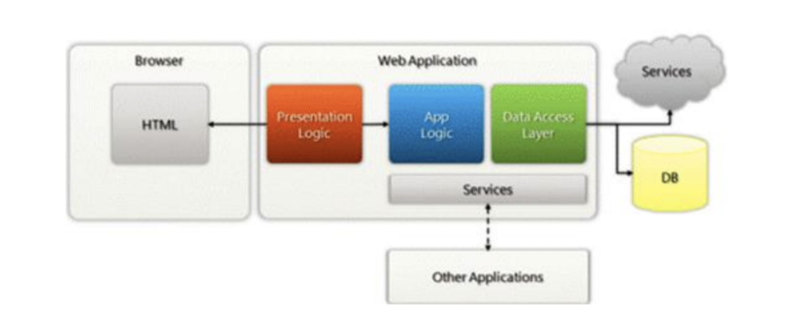
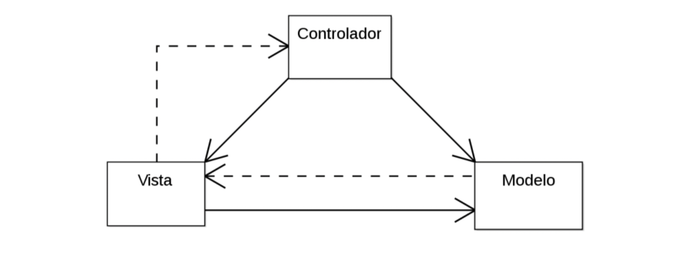
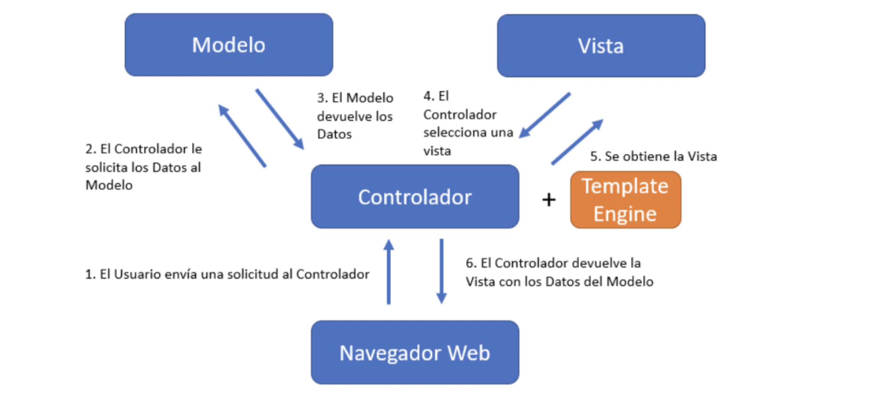

# <b>ARQUITECTURA DE SOFTWARE:</b>

## <b> MODELO EN CAPAS: </b>

- Se puede dividir el problema en varias capas
- Se logra alta cohesion entre cada capa y se logra separar la responsabilidad
- Las capas superiores usan servicios de las inferiores, pero no así de forma contraria o saltando niveles (no siempre se respeta este punto a rajatabla, se intenta)

- la capa de servicios hace uso de otros aplicativos (en realidad interactuaria con la capa de presentacion logica)

### Ventajas:
• Nos mantiene enfocados en el problema a resolver.
• Podrias tranquilamente reemplazar una capa por otra que cumpla la misma funcion y el sistema deberia funcionar, o al menos no deberia costar tanto el cambio
• Esconde el detalle de cómo se llevan a cabo los servicios que expone.
• Puede ser reemplazada la implementación de los servicios siendo transparente para los consumidores.
• Minimiza la dependencia entre componentes.
• Facilita las pruebas.

### Desventajas:
• Los cambios pueden generar efecto cascada.
• Demasiadas capas agregan complejidad y afectan negativamente al rendimiento.

## <b> CLIENTE-SERVIDOR </b>

Participan 2 componentes:
• Un servidor que provee uno o más servicios a través de una interfaz.

• Un cliente que usa esos servicios como parte de su operación en el acceso al servidor.

## Clasificacion:

• Cliente Activo, Servidor Pasivo: el cliente es quien posee la mayor lógica de negocio. El servidor limita su
funcionalidad a la persistencia. EJEMPLO: App desktop donde la logica completa este escrito en la app desktop. Pero si estoy trabajando colaborativamente con un grupo, tendre que tener algo de logica del lado del SV.    

• Cliente Pasivo, Servidor Pasivo: ambos componentes poseen baja lógica de negocio o simplemente son considerados
“componentes intermedios” de algo “más grande”. NO ES muy relevante estudiarlas, seria un balance entre los 2. 

LOS DOS MAS IMPORTANTES:

• Cliente Pasivo, Servidor Activo (“Cliente liviano”): el servidor posee la mayor lógica de negocio; mientras que el
cliente se limita a presentar los datos. ESTO ES UNA WEB TRADICIONAL. El diagrama borroso de arriba se corresponde un poco mas a esto

• Cliente Activo, Servidor Activo (“Cliente pesado”): la lógica de negocio está distribuida en ambos componentes. El
cliente posee la lógica de presentación de los datos. Al tener mucha logica en JS CORRIENDO del lado del browser, ahi voy a tener un cliente mas pesado. Le estariamos sacando procesamiento al sv, solo el sv devuelve el dato puro y el front o browser se encarga de lo demas. La desventaja es el rendimiento afectado del usuario (segun el dispositivo que tenga)

###Ventajas
• Mantenibilidad: Cambios de funcionalidad Centralizados
• Seguridad: Centralización de Control de Accesos a recursos

###Desventajas
• Eficiencia (tiempo de respuesta): El servidor puede ser un cuello de botella
• Disponibilidad: Único punto de falla

## MVC:

Modelo-vista-controlador (MVC) es un patrón de arquitectura de software de INTERACCION que separa la arquitectura en
tres componentes: el modelo, la vista y el controlador.

- la lineal me solicita algo, la punteada me devulve

- EN UNA MVC WEB (la que vamos a usar), nunca vamos a hacer que la vista interactue directamente con el modelo. En algunos otros MVC clasicos si interactua.

 
 
 
 

## TP:
- revisar el modelo en capas
