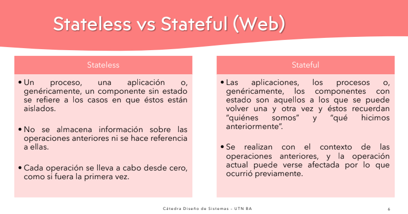
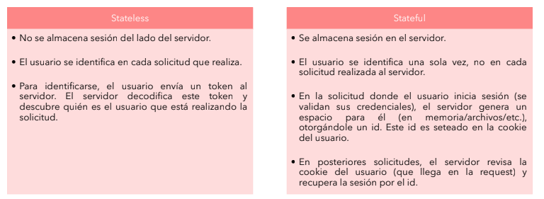
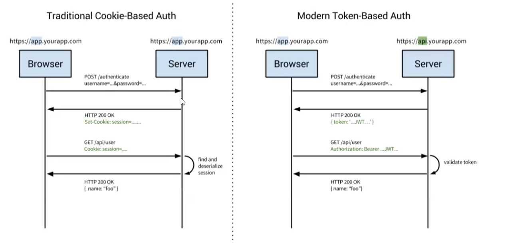

contenido previo: PROSERVICES con javalin

## SESION

• Las sesiones sirven para identificar al usuario que está intentando acceder a un recurso o ejecutar
determinada funcionalidad sobre Sistema.

• Una sesión puede almacenar temporalmente información relacionada con las actividades del usuario
mientras éste está conectado.

• No siempre es necesario contar con el concepto de sesión ya que depende del tipo de arquitectura
que se haya establecido para el aplicativo.

• Para comprender cómo funcionan las sesiones es necesario conocer cómo se manejan las cookies

## COOKIES

• Un archivo pequeño que se guarda en los dispositivos de las personas para ayudar a almacenar las preferencias y demás información que se utiliza en las páginas web que visitan.

• Una cookie es un pequeño archivo de datos creado por el Servidor pero almacenado en el cliente.

• Las cookies viajan al Servidor que las creó en cada request que el cliente le realice.

• En su sentido más amplio, sirven generalmente para que el Servidor pueda identificar y reconocer al
usuario que está realizando la request.

### Sistema stateful o stateless (web): 

Gralmente el stateful guarda en la db alguna informacion o estado oon el que pueda identificar una sesion anterior o cierta informacion de alguna request pasada y modificar su respuesta en base a lo obtenido de su db

- La arquitectura  stateless es mas actual y usado que el stateful.
- las sesiones se pueden mantener en:
    - archivos
    - memoria
    - db (menos usada)

### STATEFUL | STATELESS

#### ENTONCES:
• En una arquitectura stateful -> Cliente guarda la cookie en su dispositivo, PERO el servidor guarda la sesion (identifica al usuario por el id asignado en esa cookie que el server le instalo, porque cuando el user vuelva a ejecutar una request al server lo hara con esa cookie).

• En una arquitectura stateless -> NO sucede nada de eso, no estoy guardando en mi servidor info del cliente, sino que al envi arte el token jwt, cuando el cliente lo envie en cualquier otra request como header, yo siendo server voy a verificar que cliente es, y recien ahi en base a eso matcheare con la info que tenga en my db.
• Mucha diferencia en ESCALABILIDAD

- que pasa si se reinicia el sv? si guardaba las sesiones en memoria, las voy a perder, si es en archivos o db cuando levante seguiran estando hasta que yo decida destruirlas.

### ESTRUCTURA MVC (ver en markdown)

    Java
        proservices
        |_ controllers
        |_ models
            |_repositories
            |_?
        |_ server
            |_utils
        resources
        |_meta-inf
        |_public
        |_templates (handlebars)
            |_servicios.hbs

### codigo:

- min 1:30hs explica inyeccion de dependencia junto a patron Factory para no repetir la creacion de nuevos Controllers por distinto endpoint

- min 1:50 renderizar una vista. handlebars

- min 2:10 dentro de handlebars, explicacion de solo permitido llamar a metodos sin parametros. Por concepto no deberia poder acceder al dominio. Para eso existenlos DTOs y el acceso a sus datos planos.

- min 2:20 colisiones de endpoints