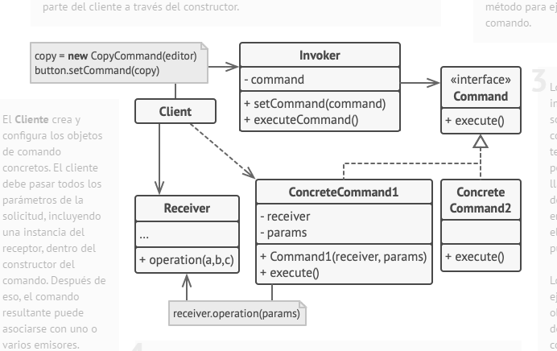
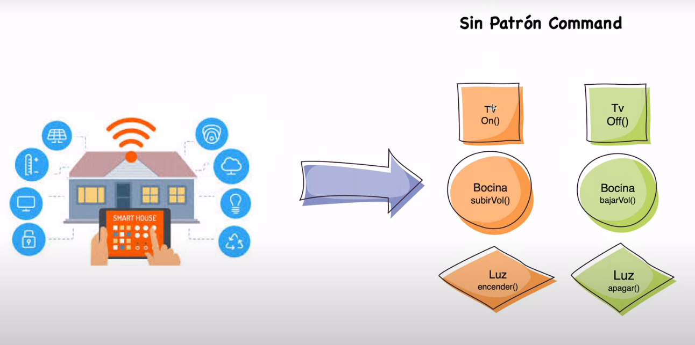
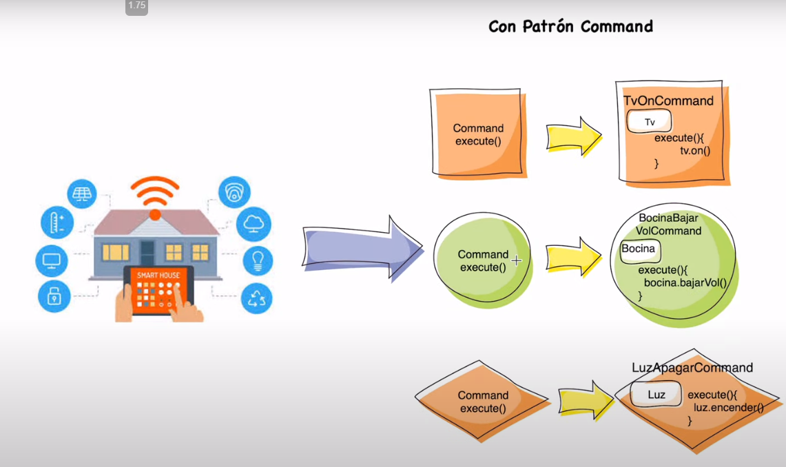
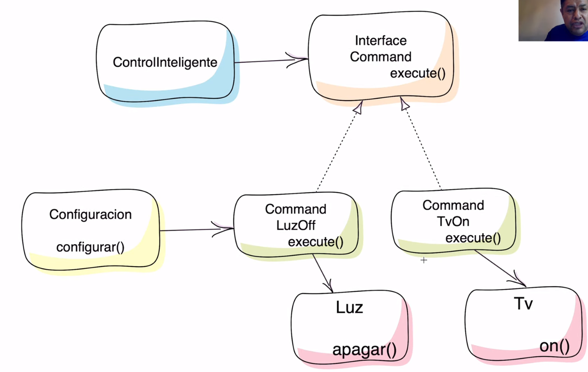

1. La clase Emisora (o invocadora) es responsable de inicializar las solicitudes. Esta clase debe tener un campo para almacenar una referencia a un objeto de comando. El emisor activa este comando en lugar de enviar la solicitud directamente al receptor. Ten en cuenta que el emisor no es responsable de crear el objeto de comando. Normalmente, obtiene un comando precreado de parte del cliente a través del constructor.
2. La interfaz Comando normalmente declara un único método para ejecutar el comando.
3. Los Comandos Concretos implementan varios tipos de solicitudes. Un comando concreto no se supone que tenga que realizar el trabajo por su cuenta, sino pasar la llamada a uno de los objetos de la lógica de negocio. Sin embargo, para lograr simplificar el código, estas clases se pueden fusionar.Los parámetros necesarios para ejecutar un método en un objeto receptor pueden declararse como campos en el comando concreto. Puedes hacer inmutables los objetos de comando permitiendo la inicialización de estos campos únicamente a través del constructor.
4. La clase Receptora contiene cierta lógica de negocio. Casi cualquier objeto puede actuar como receptor. La mayoría de los comandos solo gestiona los detalles sobre cómo se pasa una solicitud al receptor, mientras que el propio receptor hace el trabajo real.
5. El Cliente crea y configura los objetos de comando concretos. El cliente debe pasar todos los parámetros de la solicitud, incluyendo una instancia del receptor, dentro del constructor del comando. Después de eso, el comando resultante puede asociarse con uno o varios emisores.

## Aplicabilidad

* Utiliza el patrón Command cuando quieras parametrizar objetos con operaciones.
    *  El patrón Command puede convertir una llamada a un método específico en un objeto autónomo. Este cambio abre la puerta a muchos usos interesantes: puedes pasar comandos como argumentos de método, almacenarlos dentro de otros objetos, cambiar comandos vinculados durante el tiempo de ejecución, etc.
    * Aquí tienes un ejemplo: estás desarrollando un componente GUI, como un menú contextual, y quieres que los usuarios puedan configurar opciones del menú que activen operaciones cuando un usuario final haga clic sobre ellos.
  
   
   

*  Utiliza el patrón Command cuando quieras poner operaciones en cola, programar su ejecución, o ejecutarlas de forma remota.

*  Utiliza el patrón Command cuando quieras implementar operaciones reversibles.
    * Aunque hay muchas formas de implementar deshacer/rehacer, el patrón Command es quizá la más popular de todas. Para poder revertir operaciones, debes implementar el historial de las operaciones realizadas. El historial de comando es una pila que contiene todos los objetos de comando ejecutados junto a copias de seguridad relacionadas del estado de la aplicación.

## ejemplo del codigo:

- antes:

- despues:

- uml del ejemplo:

## ventajas:

* Principio de responsabilidad única. Puedes desacoplar las clases que invocan operaciones de las que realizan esas operaciones.
* Principio de abierto/cerrado. Puedes introducir nuevos comandos en la aplicación sin descomponer el código cliente existente.
* Puedes implementar deshacer/rehacer.
* Puedes implementar la ejecución diferida de operaciones.
* Puedes ensamblar un grupo de comandos simples para crear uno complejo

## desventajas:

* El código puede complicarse, ya que estás introduciendo una nueva capa entre emisores y receptores.