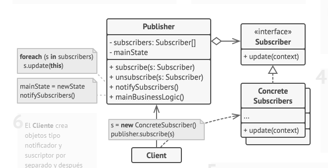
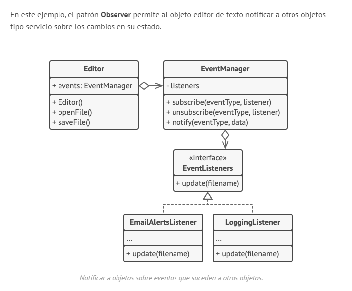

## PROPOSITO
- Observer es un patrón de diseño de comportamiento que te permite definir un mecanismo de suscripción para notificar a varios objetos sobre cualquier evento que le suceda al objeto que están observando.

- El patrón Observer define una dependencia de uno a muchos entre objetos, de manera que cuando un objeto cambia su estado, todos los objetos que dependen de él son notificados y actualizados automáticamente.

1. El Notificador envía eventos de interés a otros objetos. Esos eventos ocurren cuando el notificador cambia su estado o ejecuta algunos comportamientos. Los notificadores contienen una infraestructura de suscripción que permite a nuevos y antiguos suscriptores abandonar la lista.
2. Cuando sucede un nuevo evento, el notificador recorre la lista de suscripción e invoca el método de notificación declarado en la interfaz suscriptora en cada objeto suscriptor
3. La interfaz Suscriptora declara la interfaz de notificación. En la mayoría de los casos, consiste en un único método actualizar. El método puede tener varios parámetros que permitan al notificador pasar algunos detalles del evento junto a la actualización.
4. Los Suscriptores Concretos realizan algunas acciones en respuesta a las notificaciones emitidas por el notificador. Todas estas clases deben implementar la misma interfaz de forma que el notificador no esté acoplado a clases concretas.
5. Normalmente, los suscriptores necesitan cierta información contextual para manejar correctamente la actualización. Por este motivo, a menudo los notificadores pasan cierta información de contexto como argumentos del método de notificación. El notificador puede pasarse a sí mismo como argumento, dejando que los suscriptores extraigan la información necesaria directamente.
6. El Cliente crea objetos tipo notificador y suscriptor por separado y después registra a los suscriptores para las actualizaciones del notificador.

- La lista de suscriptores se compila dinámicamente: los objetos pueden empezar o parar de escuchar notificaciones durante el tiempo de ejecución, dependiendo del comportamiento que desees para tu aplicación.

- En esta implementación, la clase editora no mantiene la lista de suscripción por sí misma. Delega este trabajo al objeto ayudante especial dedicado justo a eso. Puedes actualizar ese objeto para que sirva como despachador centralizado de eventos, dejando que cualquier objeto actúe como notificador.

- Añadir nuevos suscriptores al programa no requiere cambios en clases notificadoras existentes, siempre y cuando trabajen con todos los suscriptores a través de la misma interfaz.

## Aplicabilidad

* Utiliza el patrón Observer cuando los cambios en el estado de un objeto puedan necesitar cambiar otros objetos y el grupo de objetos sea desconocido de antemano o cambie dinámicamente.
  * El patrón Observer permite que cualquier objeto que implemente la interfaz suscriptora pueda suscribirse a notificaciones de eventos en objetos notificadores.

*  Utiliza el patrón cuando algunos objetos de tu aplicación deban observar a otros, pero sólo durante un tiempo limitado o en casos específicos.
  * La lista de suscripción es dinámica, por lo que los suscriptores pueden unirse o abandonar la lista cuando lo deseen.

## ventajas

- Principio de abierto/cerrado. Puedes introducir nuevas clases suscriptoras sin tener que cambiar el código de la notificadora (y viceversa si hay una interfaz notificadora).
- Puedes establecer relaciones entre objetos durante el tiempo de ejecución.

## desventajas

- Los suscriptores son notificados en un orden aleatorio.