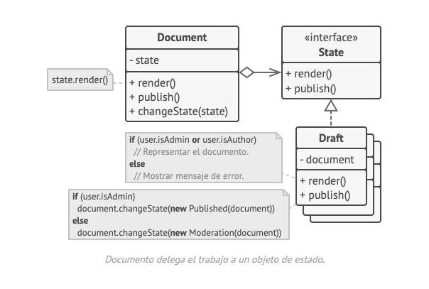
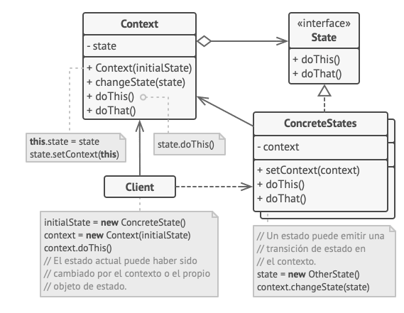
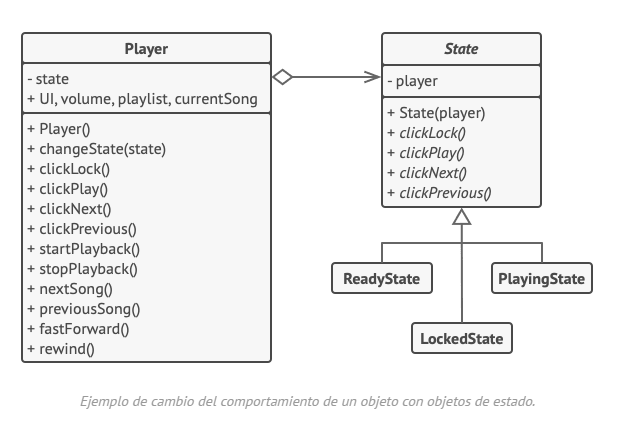

## Proposito 

State es un patrón de diseño de comportamiento que permite a un objeto alterar su comportamiento cuando su estado interno cambia. Parece como si el objeto cambiara su clase.

La idea principal es que, en cualquier momento dado, un programa puede encontrarse en un número finito de estados. Dentro de cada estado único, el programa se comporta de forma diferente y puede cambiar de un estado a otro instantáneamente. S

```
class Document is
    field state: string
    // ...
    method publish() is
        switch (state)
            "draft":
                state = "moderation"
                break
            "moderation":
                if (currentUser.role == "admin")
                state = "published"
                break
            "published":
                // No hacer nada.
                break
    // ...
```
La mayor debilidad de una máquina de estado basada en condicionales se revela una vez que empezamos a añadir más y más estados y comportamientos dependientes de estados a la clase Documento. La mayoría de los métodos contendrán condicionales monstruosos que eligen el comportamiento adecuado de un método de acuerdo con el estado actual.

## Solucion
El patrón State sugiere que crees nuevas clases para todos los estados posibles de un objeto y extraigas todos los comportamientos específicos del estado para colocarlos dentro de esas clases.

En lugar de implementar todos los comportamientos por su cuenta, el objeto original, llamado contexto, almacena una referencia a uno de los objetos de estado que representa su estado actual y delega todo el trabajo relacionado con el estado a ese objeto.



Esta estructura puede resultar similar al patrón Strategy, pero hay una diferencia clave. En el patrón State, los estados particulares pueden conocerse entre sí e iniciar transiciones de un estado a otro, mientras que las estrategias casi nunca se conocen.

### Estructura gral:



1. La clase Contexto almacena una referencia a uno de los objetos de estado concreto y le delega todo el trabajo específico del estado. El contexto se comunica con el objeto de estado a través de la interfaz de estado. El contexto expone un modificador (setter) para pasarle un nuevo objeto de estado.
2. La interfaz Estado declara los métodos específicos del estado. Estos métodos deben tener sentido para todos los estados concretos, porque no querrás que uno de tus estados tenga métodos inútiles que nunca son invocados.
3. Los Estados Concretos proporcionan sus propias implementaciones para los métodos específicos del estado. Para evitar la duplicación de código similar a través de varios estados, puedes incluir clases abstractas intermedias que encapsulen algún comportamiento común. Los objetos de estado pueden almacenar una referencia inversa al objeto de contexto. A través de esta referencia, el estado puede extraer cualquier información requerida del objeto de contexto, así como iniciar transiciones de estado.
4. Tanto el estado de contexto como el concreto pueden establecer el nuevo estado del contexto y realizar la transición de estado sustituyendo el objeto de estado vinculado al contexto.

### UML del codigo de ejemplo:



## Aplicabilidad

* Utiliza el patrón State cuando tengas un objeto que se comporta de forma diferente dependiendo de su estado actual, el número de estados sea enorme y el código específico del estado cambie con frecuencia.
  * El patrón sugiere que extraigas todo el código específico del estado y lo metas dentro de un grupo de clases específicas. Como resultado, puedes añadir nuevos estados o cambiar los existentes independientemente entre sí, reduciendo el costo de mantenimiento.

* Utiliza el patrón cuando tengas una clase contaminada con enormes condicionales que alteran el modo en que se comporta la clase de acuerdo con los valores actuales de los campos de la clase.
  * El patrón State te permite extraer ramas de esos condicionales a métodos de las clases estado correspondientes. Al hacerlo, también puedes limpiar campos temporales y métodos de ayuda implicados en código específico del estado de fuera de tu clase principal.

## VENTAJAS 

1. Principio de responsabilidad única. Organiza el código relacionado con estados particulares en clases separadas.
2. Principio de abierto/cerrado. Introduce nuevos estados sin cambiar clases de estado existentes o la clase contexto.
3. Simplifica el código del contexto eliminando voluminosos condicionales de máquina de estados.

## DESVENTAJAS

1. Aplicar el patrón puede resultar excesivo si una máquina de estados sólo tiene unos pocos estados o raramente cambia.

## RELACION CON OTROS PATRONES

- Bridge, State, Strategy (y, hasta cierto punto, Adapter) tienen estructuras muy similares. De hecho, todos estos patrones se basan en la composición, que consiste en delegar trabajo a otros objetos. Sin embargo, todos ellos solucionan problemas diferentes. Un patrón no es simplemente una receta para estructurar tu código de una forma específica. También puede comunicar a otros desarrolladores el problema que resuelve.

- State puede considerarse una extensión de Strategy. Ambos patrones se basan en la composición: cambian el comportamiento del contexto delegando parte del trabajo a objetos ayudantes. Strategy hace que estos objetos sean completamente independientes y no se conozcan entre sí. Sin embargo, State no restringe las dependencias entre estados concretos, permitiéndoles alterar el estado del contexto a voluntad.