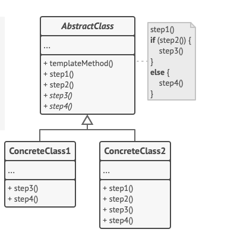

## Proposito

Template Method es un patrón de diseño de comportamiento que define el esqueleto de un algoritmo en la superclase pero permite que las subclases sobrescriban pasos del algoritmo sin cambiar su estructura.

1. La Clase Abstracta declara métodos que actúan como pasos de un algoritmo, así como el propio método plantilla que invoca estos métodos en un orden específico. Los pasos pueden declararse abstractos o contar con una implementación por defecto.

2. Las Clases Concretas pueden sobrescribir todos los pasos, pero no el propio método plantilla.

## ejemplo - codigo:
En este ejemplo, el patrón Template Method proporciona un “esqueleto” para varias ramas de inteligencia artificial (IA) en un sencillo videojuego de estrategia.

Todas las razas del juego tienen tipos de unidades y edificios casi iguales. Por lo tanto, puedes reutilizar la misma estructura IA para varias de ellas, a la vez que puedes sobrescribir algunos de los detalles. Con esta solución, puedes sobrescribir la IA de los orcos para que sean más agresivos, hacer que los humanos tengan una actitud más defensiva y hacer que los monstruos no puedan construir nada. Para añadir una nueva raza al juego habría que crear una nueva subclase IA y sobrescribir los métodos por defecto declarados en la clase IA base.

## Aplicabilidad

* Utiliza el patrón Template Method cuando quieras permitir a tus clientes que extiendan únicamente pasos particulares de un algoritmo, pero no todo el algoritmo o su estructura
  * El patrón Template Method te permite convertir un algoritmo monolítico en una serie de pasos individuales que se pueden extender fácilmente con subclases, manteniendo intacta la estructura definida en una superclase.

* Utiliza el patrón cuando tengas muchas clases que contengan algoritmos casi idénticos, pero con algunas diferencias mínimas. Como resultado, puede que tengas que modificra todas las clases cuando el algoritmo cambie.

## VENTAJAS:

* Puedes permitir a los clientes que sobrescriban tan solo ciertas partes de un algoritmo grande, para que les afecten menos los cambios que tienen lugar en otras partes del algoritmo.
* Puedes colocar el código duplicado dentro de una superclase.

# DESVENTAJAS:

* Algunos clientes pueden verse limitados por el esqueleto proporcionado de un algoritmo.
* Puede que violes el principio de sustitución de Liskov suprimiendo una implementación por defecto de un paso a través de una subclase.
* Los métodos plantilla tienden a ser más difíciles de mantener cuantos más pasos tengan.

