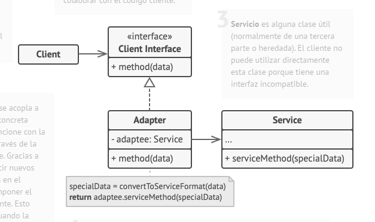
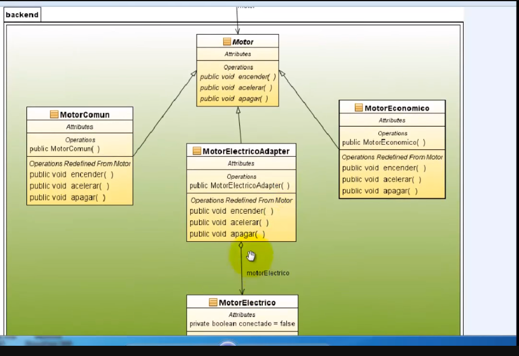

## PROPOSITO

https://www.youtube.com/watch?v=lpsNlnbPmKw&t=1s&ab_channel=Programaci%C3%B3nym%C3%A1s

Adapter es un patrón de diseño estructural que permite la colaboración entre objetos con interfaces incompatibles.

Esta implementación utiliza el principio de composición de objetos: el adaptador implementa la interfaz de un objeto y envuelve el otro. Puede implementarse en todos los lenguajes de programación populares.

1. La clase Cliente contiene la lógica de negocio existente del programa.
2. La Interfaz con el Cliente describe un protocolo que otras clases deben seguir para poder colaborar con el código cliente.
3. Servicio es alguna clase útil (normalmente de una tercera parte o heredada). El cliente no puede utilizar directamente esta clase porque tiene una interfaz incompatible.
4. La clase Adaptadora es capaz de trabajar tanto con la clase cliente como con la clase de servicio: implementa la interfaz con el cliente, mientras envuelve el objeto de la clase de servicio. La clase adaptadora recibe llamadas del cliente a través de la interfaz adaptadora y las traduce en llamadas al objeto envuelto de la clase de servicio, pero en un formato que pueda comprender.
5. El código cliente no se acopla a la clase adaptadora concreta siempre y cuando funcione con la clase adaptadora a través de la interfaz con el cliente. Gracias a esto, puedes introducir nuevos tipos de adaptadores en el programa sin descomponer el código cliente existente. Esto puede resultar útil cuando la interfaz de la clase de servicio se cambia o sustituye, ya que puedes crear una nueva clase adaptadora sin cambiar el código cliente.

## EJEMPLO UML

## APLICABILIDAD

* Utiliza la clase adaptadora cuando quieras usar una clase existente, pero cuya interfaz no sea compatible con el resto del código.
* Utiliza el patrón cuando quieras reutilizar varias subclases existentes que carezcan de alguna funcionalidad común que no pueda añadirse a la superclase.
  *  Puedes extender cada subclase y colocar la funcionalidad que falta, dentro de las nuevas clases hijas. No obstante, deberás duplicar el código en todas estas nuevas clases, lo cual huele muy mal.
  Una solución mucho más elegante sería colocar la funcionalidad que falta dentro de una clase adaptadora. Después puedes envolver objetos a los que les falten funciones, dentro de la clase adaptadora, obteniendo esas funciones necesarias de un modo dinámico. Para que esto funcione, las clases en cuestión deben tener una interfaz común y el campo de la clase adaptadora debe seguir dicha interfaz. Este procedimiento es muy similar al del patrón Decorator.

## VENTAJAS

1. [ ] Principio de responsabilidad única. Puedes separar la interfaz o el código de conversión de datos de la lógica de negocio primaria del programa.
2. [ ] Principio de abierto/cerrado. Puedes introducir nuevos tipos de adaptadores al programa sin descomponer el código cliente existente, siempre y cuando trabajen con los adaptadores a través de la interfaz con el cliente.

## DESVENTAJAS

1. [ ] La complejidad general del código aumenta, ya que debes introducir un grupo de nuevas interfaces y clases. En ocasiones resulta más sencillo cambiar la clase de servicio de modo que coincida con el resto de tu código.

# RELACION CON OTROS PATRONES

1. [ ] Adapter cambia la interfaz de un objeto existente mientras que Decorator mejora un objeto sin cambiar su interfaz. Además, Decorator soporta la composición recursiva, lo cual no es posible al utilizar Adapter.