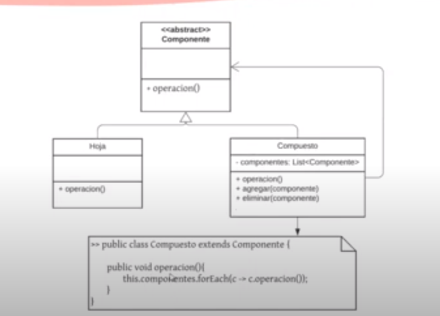
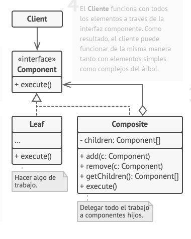

## Proposito

Compone objetos en estructuras de árbol para representar jerarquías de parte-todo. El patrón permite a los clientes tratar de manera uniforme a los objetos individuales y a los compuestos.

Permite que un cliente trate de forma polimorfica a un objeto particular y a un conjunto combinado de ellos.

1. a interfaz Componente describe operaciones que son comunes a elementos simples y complejos del árbol.
2. La Hoja es un elemento básico de un árbol que no tiene subelementos. Normalmente, los componentes de la hoja acaban realizando la mayoría del trabajo real, ya que no tienen a nadie a quien delegarle el trabajo.
3. El Contenedor (también llamado compuesto) es un elemento que tiene subelementos: hojas u otros contenedores. Un contenedor no conoce las clases concretas de sus hijos. Funciona con todos los subelementos únicamente a través de la interfaz componente. Al recibir una solicitud, un contenedor delega el trabajo a sus subelementos, procesa los resultados intermedios y devuelve el resultado final al cliente.
4. El Cliente funciona con todos los elementos a través de la interfaz componente. Como resultado, el cliente puede funcionar de la misma manera tanto con elementos simples como complejos del árbol.

Utiliza el patrón Composite cuando tengas que implementar una estructura de objetos con forma de árbol.

Utiliza el patrón cuando quieras que el código cliente trate elementos simples y complejos de la misma forma.