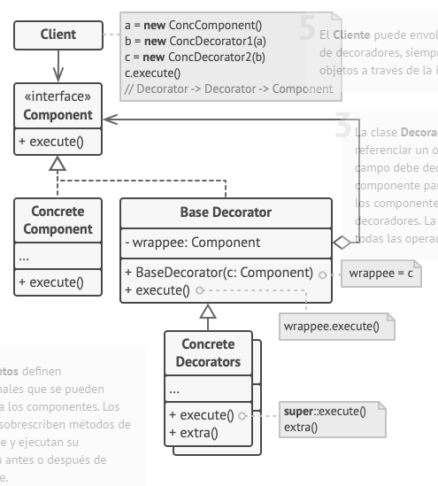

## Proposito

Agrega funcionalidades dinamicamente a un objeto sin romper su interfaz

Intercepta mensajes

Se sugiere su utilizacion cuando:
- Se requiere agregar y/o quitar funcionalidades/responsabilidades a un objeto en momento de ejecucion
- Existen condicionales que restrigen/amplian las acciones que realiza un objeto frente a la recepcion de un mensaje

## ejemplo decorator con composicion visto en clase 6:
- El decorator esta un poco forzado pero sirve para ver como se puede usar.

Cuando tenemos que alterar la funcionalidad de un objeto, lo primero que se viene a la mente es extender una clase. No obstante, la herencia tiene varias limitaciones importantes de las que debes ser consciente.

- La herencia es estática. No se puede alterar la funcionalidad de un objeto existente durante el tiempo de ejecución. Sólo se puede sustituir el objeto completo por otro creado a partir de una subclase diferente.
- Las subclases sólo pueden tener una clase padre. En la mayoría de lenguajes, la herencia no permite a una clase heredar comportamientos de varias clases al mismo tiempo.

¿Cuándo se convierte un simple wrapper en el verdadero decorador? el wrapper implementa la misma interfaz que el objeto envuelto. Éste es el motivo por el que, desde la perspectiva del cliente, estos objetos son idénticos. Haz que el campo de referencia del wrapper acepte cualquier objeto que siga esa interfaz. Esto te permitirá envolver un objeto en varios wrappers, añadiéndole el comportamiento combinado de todos ellos.

1. El Componente declara la interfaz común tanto para wrappers como para objetos envueltos.
2. Componente Concreto es una clase de objetos envueltos. Define el comportamiento básico, que los decoradores pueden alterar.
3. La clase Decoradora Base tiene un campo para referenciar un objeto envuelto. El tipo del campo debe declararse como la interfaz del componente para que pueda contener tanto los componentes concretos como los decoradores. La clase decoradora base delega todas las operaciones al objeto envuelto.
4. Los Decoradores Concretos definen funcionalidades adicionales que se pueden añadir dinámicamente a los componentes. Los decoradores concretos sobrescriben métodos de la clase decoradora base y ejecutan su comportamiento, ya sea antes o después de invocar al método padre.
5. El Cliente puede envolver componentes en varias capas de decoradores, siempre y cuando trabajen con todos los objetos a través de la interfaz del componente.

## APLICABILIDAD

* Utiliza el patrón Decorator cuando necesites asignar funcionalidades adicionales a objetos durante el tiempo de ejecución sin descomponer el código que utiliza esos objetos.

* Utiliza el patrón cuando resulte extraño o no sea posible extender el comportamiento de un objeto utilizando la herencia.
    * Muchos lenguajes de programación cuentan con la palabra clave final que puede utilizarse para evitar que una clase siga extendiéndose. Para una clase final, la única forma de reutilizar el comportamiento existente será envolver la clase con tu propio wrapper, utilizando el patrón Decorator.

### VENTAJAS:

1. [ ] Puedes extender el comportamiento de un objeto sin crear una nueva subclase.
2. [ ] Puedes añadir o eliminar responsabilidades de un objeto durante el tiempo de ejecución.
3. [ ] Puedes combinar varios comportamientos envolviendo un objeto con varios decoradores.
4. [ ] Principio de responsabilidad única. Puedes dividir una clase monolítica que implementa muchas variantes posibles de comportamiento, en varias clases más pequeñas.

### DESVENTAJAS:

1. [ ] Resulta difícil eliminar un wrapper específico de la pila de wrappers.
2. [ ] Es difícil implementar un decorador de tal forma que su comportamiento no dependa del orden en la pila de decoradores.
3. [ ] El código de configuración inicial de las capas pueden tener un aspecto desagradable.