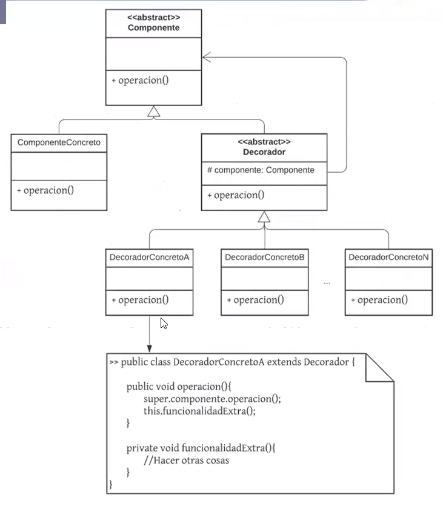
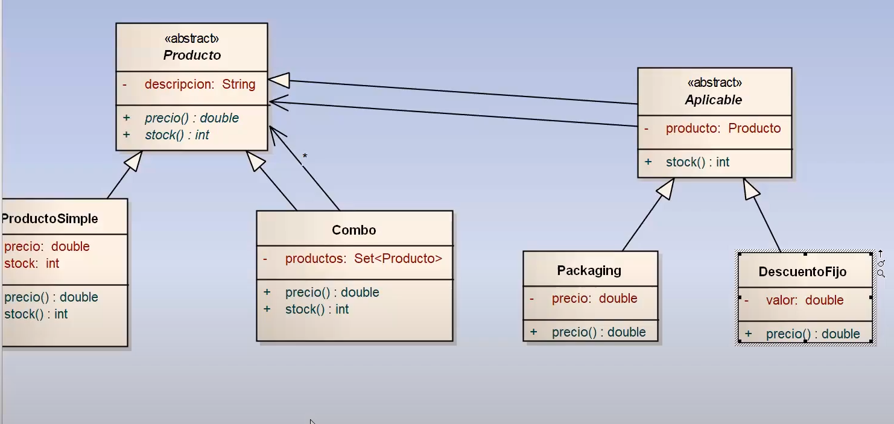

## Proposito

Agrega funcionalidades dinamicamente a un objeto sin romper su interfaz

Intercepta mensajes

Se sugiere su utilizacion cuando:
- Se requiere agregar y/o quitar funcionalidades/responsabilidades a un objeto en momento de ejecucion
- Existen condicionales que restrigen/amplian las acciones que realiza un objeto frente a la recepcion de un mensaje

## ejemplo decorator con composicion visto en clase 6:
- El decorator esta un poco forzado pero sirve para ver como se puede usar.

